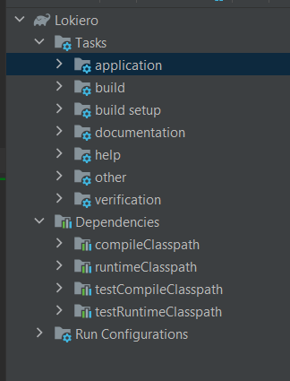

Console Social Networking Platform Sample 
=========================================

## Running

### requirements
* Docker and Docker Compose (https://docs.docker.com/install/) 
* Java 11 (https://openjdk.java.net/install/) 

### Run

```
docker-compose up -d
```

(mariadb container add sample data in BBDD) -> [init.sql](/etc/docker/dev/mariadb/init.sql)

To run the application, run the following command in a terminal window (in the complete) directory:

```
./gradlew bootRun
```

### Available commands:  
For posting writte: user name -> message
Alice -> Hello world

For reader writte: user name
Bob

For following writte: user name follows another user
Alice follows Bob

For view wall writte: user name wall
Bob wall

### Execute test
```
./gradlew test
```

### For developers and testers
For developers is recomended use IntelliJ IDEA to run the application, use gradle for build application



For more details technical in the [technical.md](doc/technical.md)

## What is Console Social Network Sample?
Implement a console-based social networking application (similar to Twitter) satisfying the scenarios below.

<h2>Scenarios</h2>

 Posting: Alice can publish messages to a personal timeline
 
```
> Alice -> I love the weather today
> Bob -> Damn! We lost!
> Bob -> Good game though.
```
 Reading: Bob can view Alice’s timeline
 
```
> Alice
I love the weather today (5 minutes ago)
> Bob
Good game though. (1 minute ago)
Damn! We lost! (2 minutes ago)
```

 Following: Charlie can subscribe to Alice’s and Bob’s timelines, and view an aggregated list of all subscriptions
 
```
> Charlie -> I'm in New York today! Anyone want to have a coffee?
> Charlie follows Alice
> Charlie wall
Charlie - I'm in New York today! Anyone want to have a coffee? (2 seconds ago)
Alice - I love the weather today (5 minutes ago)

> Charlie follows Bob
> Charlie wall
Charlie - I'm in New York today! Anyone wants to have a coffee? (15 seconds ago)
Bob - Good game though. (1 minute ago)
Bob - Damn! We lost! (2 minutes ago)
Alice - I love the weather today (5 minutes ago)
```

## Details

* The application must use the console for input and output.
* Users submit commands to the application. 
* There are four commands. “posting”, “reading”, etc. are not part of the commands.
* Commands always start with the user’s name.
* posting: user name -> message
* reading: user name
* following: user name follows another user
* wall: user name wall 

## TODO 

* Use transformers o serializers library to response object (VO) to view
* Use library to mapper DTO (remove method to and make) in infrastucture layer with domain entities
* User factory or strategy pattern in CommandLineController to delegate
* TODO crated functional test with docker container and gradle test
