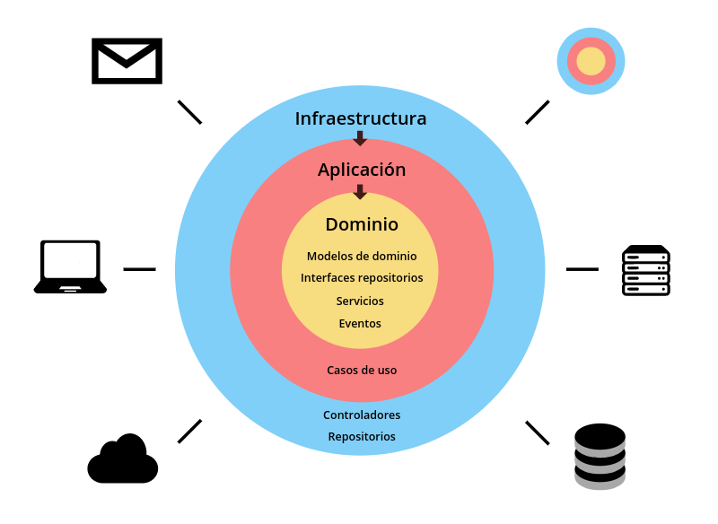
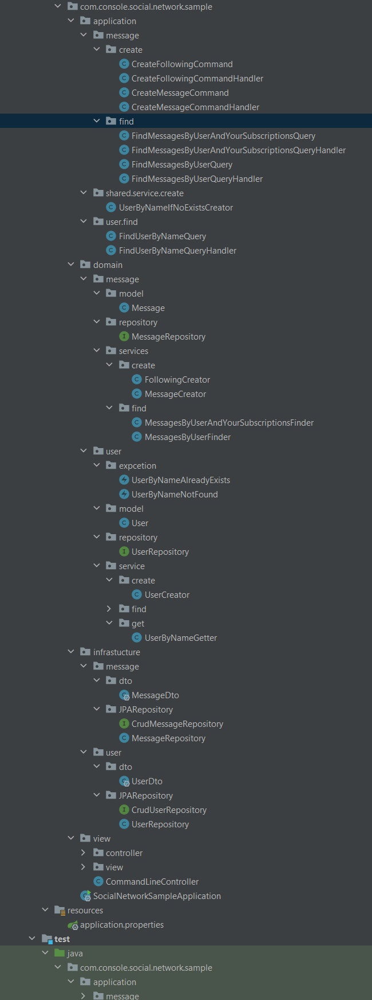
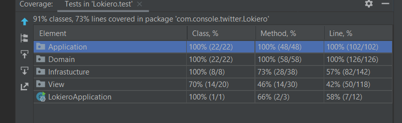

## Hexagonal architecture

User three layers:

### Application layer:
Application layer, use class for render and controller, and very import use case to acces the domin layer, 100% testing is mandatory.

### Domain layer:
(use respository interface for use infracture layer, in this case BBDD), is 100% testing is mandatory

### Infracture layer
User JPA for persist data and use Hibernate, only testing the minimal not is mandatory testiing.

## Dependency Injection
Use the sprintboot for injected depdencies, for example to interface to use infrastructure layer.

## Test
In the case only crate unitary test, use the sprintboot test
The coverage is 100% in domain layer and application is the very import.

